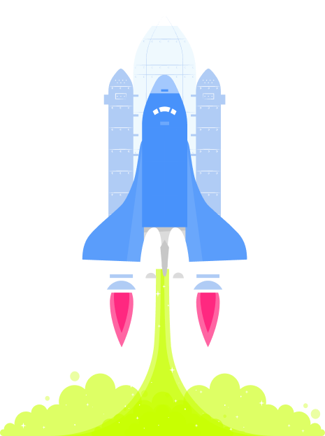

<a name="readme-top"></a>
[](https://github.com/julienbrs)
[![LinkedIn][linkedin-shield]][linkedin-url]

<!-- PROJECT LOGO -->
<br />
<div align="center">
  <a href="https://github.com/julienbrs/Mail-invaders">
    
  </a>

<h3 align="center">Mail Invaders</h3>

  </p>
</div>

<!-- TABLE OF CONTENTS -->

<summary>Table of Contents</summary>
<ol>
<li>
    <a href="#about-the-project">About The Project</a>
</li>
<li>
    <a href="#getting-started">Getting Started</a>
    <ul>
    <li><a href="#prerequisites">Prerequisites</a></li>
    <li><a href="#installation">Installation</a></li>
    <li><a href="#usage">Usage</a></li>
    </ul>
</li>
<li><a href="#contact">Contact</a></li>
</ol>

<br />

<!-- ABOUT THE PROJECT -->

## About The Project


A simple Mail Invaders game developed using vanilla JavaScript. The game features a mail invasion, where the player controls a spaceship that must fend off the mails. The player can move and fire laser to destroy ennemies. The game includes several bonuses including a timer bonus to prevent running out of time, and a local leaderboard to track the player's progress.
<br />

<p align="center">
  
</p>

<p align="right">(<a href="#readme-top">back to top</a>)</p>

<!-- GETTING STARTED -->

## Getting Started

To get a local copy up and running follow these simple example steps.

### Prerequisites

A modern web browser (Chrome, Firefox, Safari, Edge)

### Installation

Clone the repo:

```sh
git clone https://github.com/<YOUR_GITHUB_USERNAME>/space-invaders.git
```

Open the index.html file in your web browser to run the game.

<p align="right">(<a href="#readme-top">back to top</a>)</p>

## Usage

The game is controlled using the arrow keys to move the spaceship, spacebar to fire the laser and several key to activate bonuses. The player must destroy all the ennemies before they reach the bottom of the screen. The player starts with five lives, and loses a life if an alien reaches the bottom or if the player's spaceship is hit.

The player can collect bonuses throughout the game, such as the timer bonus to prevent running out of time and the ability to collect extra lives. There is also a local leaderboard feature to track the player's progress and compare it to other players.

<p align="right">(<a href="#readme-top">back to top</a>)</p>

<!-- CONTACT -->

## Contact

Bourseau Julien - _2nd year student at Ensimag, 2022_ - julien.bourseau@gmail.com

Project Link: [https://github.com/julienbrs/Mail-invaders](https://github.com/julienbrs/Mail-invaders)

<p align="right">(<a href="#readme-top">back to top</a>)</p>

[linkedin-shield]: https://img.shields.io/badge/-LinkedIn-black.svg?style=for-the-badge&logo=linkedin&colorB=555
[linkedin-url]: https://www.linkedin.com/in/julien-bourseau-ba2239228
